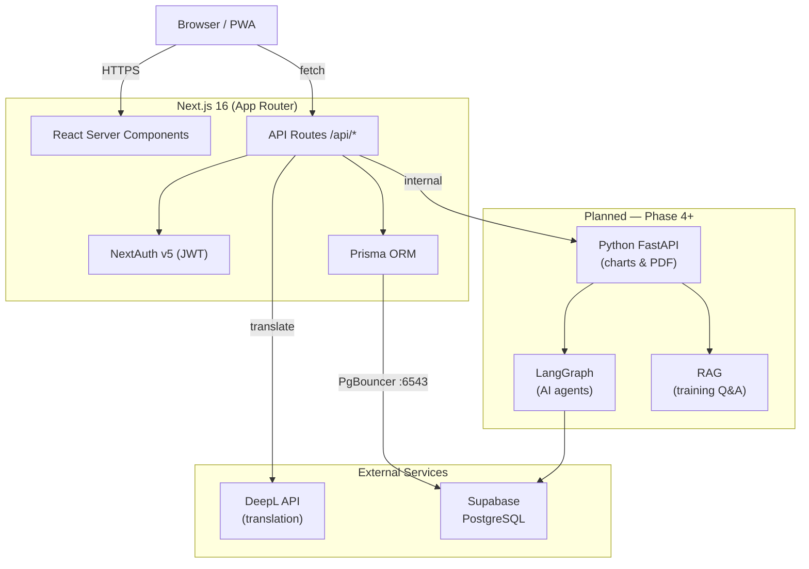

# CoachSync

CoachSync is a full-stack coach-athlete management platform built to eliminate language barriers in sports coaching. Coaches and athletes who speak different languages — Japanese, German, and English — can log sessions, exchange feedback, and track performance, with all communication auto-translated in real time via the DeepL API. A separate Python FastAPI service handles computation-heavy chart generation and weekly PDF reports, with a planned LangGraph AI layer for automated training monitoring and RAG-based coaching Q&A.

## Live Demo

🔗 **[coachsync.vercel.app](https://coachsync.vercel.app)** *(deployment in progress)*

| Role | Email | Password |
|------|-------|----------|
| Coach | coach@demo.com | demo1234 |
| Athlete | athlete@demo.com | demo1234 |

## Tech Stack


## Features

- **Session logging** — structured warmup, main sets, lap splits, RPE, and coach feedback with one-click DeepL auto-translation
- **Role-based access** — `COACH`, `ATHLETE`, and `ADMIN` roles enforced at every API route and UI layer
- **Training program management** — programs with nested sessions, upcoming/past split, and calendar view (month/week/day)
- **Athlete overview dashboard** — greeting, weekly volume, streak, personal bests, upcoming competitions, and weekly load chart
- **Invite-link pairing** — coaches generate a token-based link (24 hr expiry, single-use) to link athletes without admin setup
- **Personal records tracking** — athletes log PBs by discipline; coaches can view full history
- **Analytics** — interactive Plotly charts (volume trend, performance curve, fatigue timeline, volume heatmap) powered by Python/Pandas; graceful mock-data fallback when service is offline
- **PWA push notifications** — VAPID-based web push for session reminders

## Architecture



## Design Decisions

- **Supabase over self-hosted PostgreSQL** — managed connection pooling (PgBouncer) and direct connection are both provided out of the box, which also resolves WSL2 networking constraints during development.
- **Prisma over Drizzle/SQLAlchemy** — generated types propagate end-to-end from schema to API response, eliminating a class of runtime errors without manual type maintenance.
- **Separate FastAPI service for analytics** — Python's data science ecosystem (Pandas, Plotly, fpdf2) has no peer in JS for statistical chart generation, and isolation lets the service scale and deploy independently.
- **PgBouncer for runtime, direct connection for migrations** — `DATABASE_URL` targets port 6543 (pooled) for low-latency API queries; `DIRECT_URL` targets port 5432 for Prisma CLI migrations that require a persistent session.

## Local Development

**Prerequisites:** Node.js 20+, a [Supabase](https://supabase.com) project (free tier), a [DeepL API](https://www.deepl.com/pro-api) key (free tier).

### 1. Clone and install

```bash
git clone https://github.com/your-username/coachsync.git
cd coachsync/coachsync
npm install
```

### 2. Configure environment variables

Create `.env.local` in `coachsync/coachsync/`:

```env
DATABASE_URL="postgresql://<user>:<password>@<host>:6543/postgres?pgbouncer=true"
DIRECT_URL="postgresql://<user>:<password>@<host>:5432/postgres"
AUTH_SECRET="<run: openssl rand -hex 32>"
NEXTAUTH_URL="http://localhost:3000"
DEEPL_API_KEY="<your-deepl-key>"
VAPID_PUBLIC_KEY="<your-vapid-public-key>"
VAPID_PRIVATE_KEY="<your-vapid-private-key>"
VAPID_MAILTO="mailto:you@example.com"
# Optional — enables live analytics charts
# VIZ_SERVICE_URL="http://localhost:8000"
# VIZ_INTERNAL_KEY="<run: openssl rand -hex 32>"
```

### 3. Run database migrations and seed

```bash
npx prisma generate
npx prisma migrate deploy

# Seed with demo data: 1 coach (EN) + 4 athletes (EN/DE/JA)
npx prisma db seed
```

### 4. Start the dev server

```bash
npm run dev
```

Open [http://localhost:3000](http://localhost:3000). Log in with the seeded accounts:

| Role | Email | Password |
|------|-------|----------|
| Coach | james.carter@coachsync.dev | password123 |
| Athlete | marcus.johnson@coachsync.dev | password123 |

### 5. (Optional) Start the Python visualization service

Charts and PDF reports are disabled gracefully without this step.

```bash
cd ../viz
pip install -r requirements.txt
uvicorn main:app --reload --port 8000
```

Then add `VIZ_SERVICE_URL=http://localhost:8000` to `.env.local`.

## Roadmap

- [ ] **AI weekly monitoring agent** — LangGraph agent that reads the week's sessions and flags overtraining risk or missed targets
- [ ] **RAG-based training Q&A** — coaches ask natural-language questions over athlete history ("How has Marcus's 400m improved this quarter?")
- [ ] **Docker Compose deployment** — single `docker compose up` to run Next.js + Python service + PostgreSQL locally
- [ ] **LangSmith observability** — trace every AI agent call for debugging and cost monitoring
- [ ] **Condition tracking** — daily RPE, sleep quality, mood, and weight logging with trend visualizations

## License

MIT
